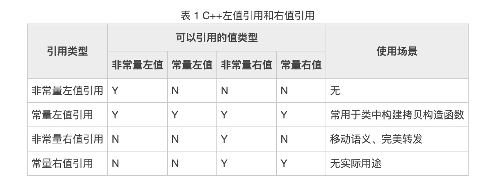

C++98/03 标准中就有引用，使用 "&" 表示。但此种引用方式有一个缺陷，即正常情况下只能操作 C++ 中的左值，无法对右值添加引用。举个例子：
```c++
int num = 10;
int &b = num; // 正确
int &c = 10; // 错误

// 和声明左值引用一样，右值引用也必须立即进行初始化操作，且只能使用右值进行初始化
// 右值引用主要用于移动语义和完美转发
int && a = 10; // 右值引用, 正确, 右值引用可以对右值进行修改
a = 100;
```
  